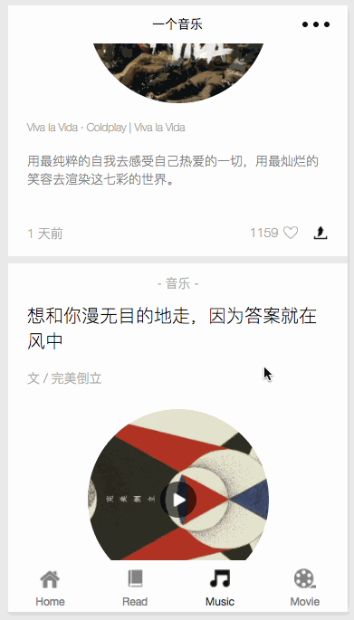

# weapp-one

入坑小程序，之前本来是决定各种文艺的APP的借鉴一下，发现自己的设计水平实在不行，请求的都是ONE的后台数据，所以最后还是按着ONE的IOS版本仿制了一下。

## 项目演示

## 简单说明

- 基于微信开发的微信小程序
- 数据请求都来自于ONE，由于不能POST数据，所以项目中的作者关注，文章收藏等等功能都使用小程序本地存储的API存储在本地中
- 启动项目需要开启开发环境不校验请求域名及TLS版本

## 功能

- 获取当前用户的登录信息，用户名、头像等等
- 每日图文，图文详情，当前ip地址，往期列表，每月图文列表，图文收藏、分享
- 每日文章，滚动卡片，卡片详情，文章阅读，相关推荐，评论列表，每月文章列表，作者关注，文章收藏、分享
- 每日音乐，音乐播放，音乐故事阅读，评论列表，每月音乐列表，作者关注，音乐故事收藏、分享
- 每日电影，电影故事阅读，电影详情介绍，评论列表，作者关注，电影故事收藏、分享

## 总结

没写！！

## LICENSE

MIT
